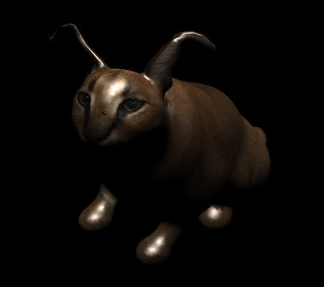

# 3D Renderer
Курсовой проект по имплементации 3D рендерера с нуля.
## Скачивание
```shell
git clone --recurse-submodules git@github.com:rualss/3d-renderer.git
git checkout dev
git submodule update --init --recursive
```
## Сборка и запуск
Перед сборкой нужно установить зависимости SFML. Все остальные библиотеки подтянутся сами
```shell
sudo apt update && sudo apt install \
     libxrandr-dev \
     libxcursor-dev \
     libxi-dev \
     libudev-dev \
     libflac-dev \
     libvorbis-dev \
     libgl1-mesa-dev \
     libegl1-mesa-dev \
     libdrm-dev \
     libgbm-dev
```
Далее в корне репозитория нужно выполнить
```shell
mkdir build
cd build
cmake -DCMAKE_BUILD_TYPE=Release ..
cmake --build . --parallel <количество потоков у процессора>
./renderer
```
## Управление
+ **W** - переместить камеру вперёд
+ **A** - переместить камеру влево
+ **S** - переместить камеру назад
+ **D** - переместить камеру вправо
+ **Up** - повернуть камеру вверх
+ **Down** - повернуть камеру вниз
+ **Right** - повернуть камеру вправо
+ **Left** - повернуть камеру влево
+ **Q** - наклонить камеру влево
+ **E** - наклонить камеру вправо

## Пример работы

